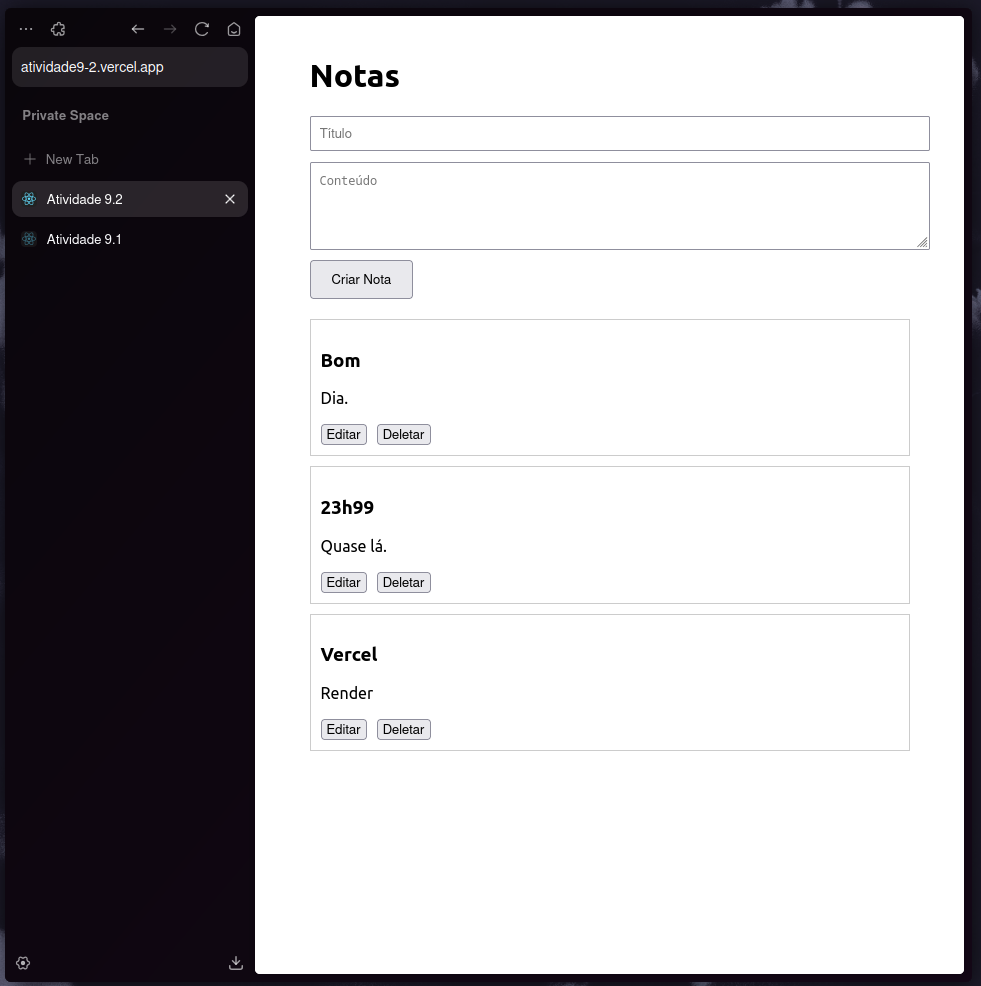
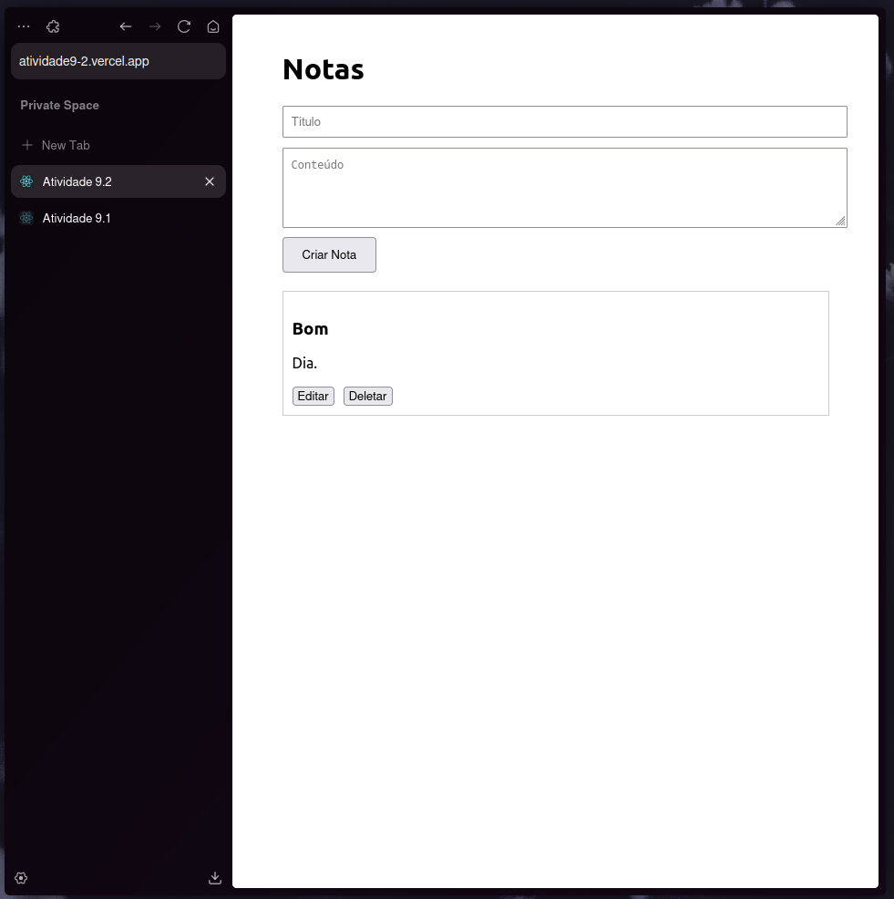

# Atividade 9.2

### Render:
https://atividade9-2.onrender.com/

### Vercel:
https://atividade9-2.vercel.app/

#### Testes API (local):

#### Testes API (remoto):
##### GET

##### POST

##### UPDATE (antes)

##### UPDATE (depois)

##### DELETE

